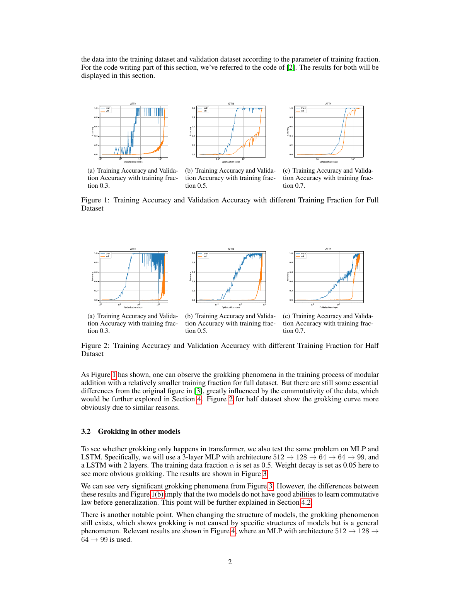

# ML-final

**Grokking on Small Algorithmic Datasets**

这是一个围绕 grokking 现象的课程项目：把模运算、群运算和多元加法写成短序列预测任务，然后训练小型神经网络，观察模型如何从“已经记住训练集”过渡到“真正泛化到未见组合”。



## 贡献者

- Jiaju Wu
- Kairui Li
- Kehan Huang

## 项目要回答的问题

Grokking 指的是一种很反直觉的训练过程：模型先把训练集拟合得很好，但验证集长时间没有改善；继续训练很多步以后，验证准确率才突然上升。这个项目以模加法为起点，继续扩展到其它代数任务，想观察：

1. 训练数据比例如何影响 grokking 出现的时间？
2. Transformer、MLP、LSTM、GRU 等架构是否都会出现类似现象？
3. AdamW、Adam、SGD、RMSprop、dropout、梯度噪声、权重噪声等优化/正则设置会怎样改变泛化曲线？
4. 从二元运算推广到 `K` 元求和时，问题难度如何变化？
5. 模型到底是在记忆表格，还是在学习隐藏的代数结构？

## 数据任务

样本统一写成短序列：

```text
<x> <op> <y> <=> <x op y>
```

训练时只监督最后一个输出 token，避免把无关语言建模损失混进任务。默认模数为 `p = 97`，训练集比例可通过 `--train-ratio` 调整。

支持的任务包括：

| 类型 | 运算 |
| --- | --- |
| 模运算 | `mod_add`, `mod_sub`, `mod_div`, `div_or_sub_by_y_parity` |
| 多项式型模运算 | `x2_y2`, `x2_xy_y2`, `x2_xy_y2_plus_x`, `x3_xy`, `x3_xy2_plus_y` |
| 群运算 | `s5_mul`, `s5_conj`, `s5_x_y_x` |
| K 元任务 | `sum_mod` / `mod_add` with `--k > 2` |

## 模型与训练

默认主模型是 decoder-only Transformer：

- 2 层 Transformer block
- hidden size `128`
- 4 个 attention heads
- causal attention mask
- 输出位置使用等号 token 占位，只预测最后一位答案

仓库还实现了 MLP、LSTM、GRU，用于比较不同架构下的泛化延迟：

```bash
python train.py --architecture transformer
python train.py --architecture mlp
python train.py --architecture lstm
python train.py --architecture gru
```

训练循环会保存：

- `training_log.csv`：训练/验证准确率和 loss
- `config.txt`：命令行和超参数
- 可选的训练曲线图
- 最佳模型 checkpoint

## 快速运行

安装依赖：

```bash
pip install torch matplotlib
```

快速 smoke run：

```bash
python train.py --op mod_add --steps 3000 --target-val-acc 0.90
```

典型 grokking 设置：

```bash
python train.py \
  --op mod_add \
  --train-ratio 0.25 \
  --steps 100000 \
  --target-val-acc 0.9995 \
  --optimizer adam \
  --dropout 0.1 \
  --grad-noise-std 1.0
```

比较不同训练比例：

```bash
python train.py --op mod_add --train-ratio 0.30 --steps 100000
python train.py --op mod_add --train-ratio 0.50 --steps 100000
python train.py --op mod_add --train-ratio 0.70 --steps 100000
```

运行群运算任务：

```bash
python train.py --op s5_mul --steps 100000
python train.py --op s5_conj --steps 100000
```

运行 K 元求和：

```bash
python train.py --op sum_mod --k 3 --steps 100000
```

## 代码结构

| Path | Purpose |
| --- | --- |
| `train.py` | 命令行入口，解析实验参数并启动训练。 |
| `mlfinal/config.py` | 训练配置数据类。 |
| `mlfinal/data.py` | 构造模运算、S5 群运算和 K 元运算数据集。 |
| `mlfinal/architectures.py` | Transformer / MLP / LSTM / GRU 实现。 |
| `mlfinal/trainer.py` | 训练、评估、记录和 early success 判断。 |
| `mlfinal/storage.py` | 保存日志、配置和训练结果。 |
| `mlfinal/utils.py` | 优化器构建、随机种子、曲线绘制等工具函数。 |
| `sample-1(2).pdf` | 项目报告，包含 grokking 曲线和实验分析。 |
| `assets/grokking_accuracy_curves.png` | 从报告中导出的代表性曲线图。 |

## 我们关注的现象

- 训练准确率先上升，验证准确率可能长期停滞。
- 继续训练后，验证准确率突然上升，出现延迟泛化。
- 训练比例越低，泛化通常越慢、越不稳定。
- 正则化、噪声、学习率和优化器会显著改变 grokking 的时间尺度。
- 若模型学到的是代数结构，它应能在未见过的输入组合上泛化；如果只记忆训练表格，验证集会失败。

## 说明

这个仓库保留的是课程项目代码与报告材料。部分长时间实验的原始运行产物没有全部提交到仓库；建议以 `sample-1(2).pdf` 和可复现实验命令作为理解入口。
